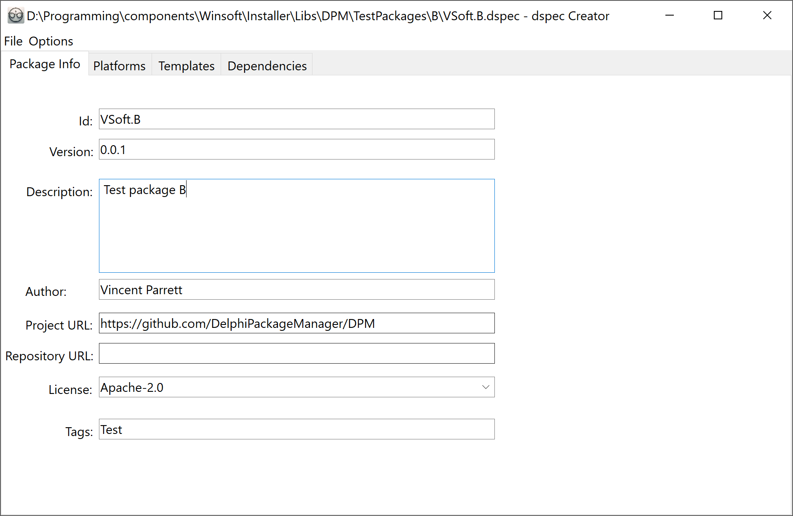
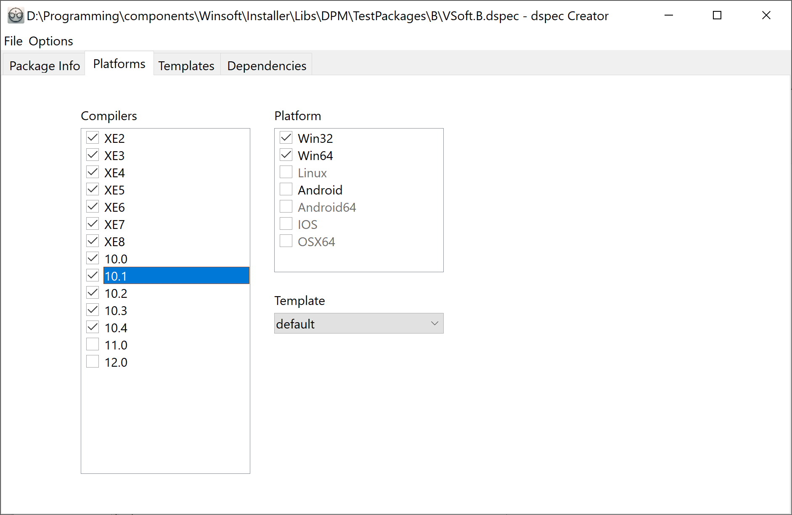
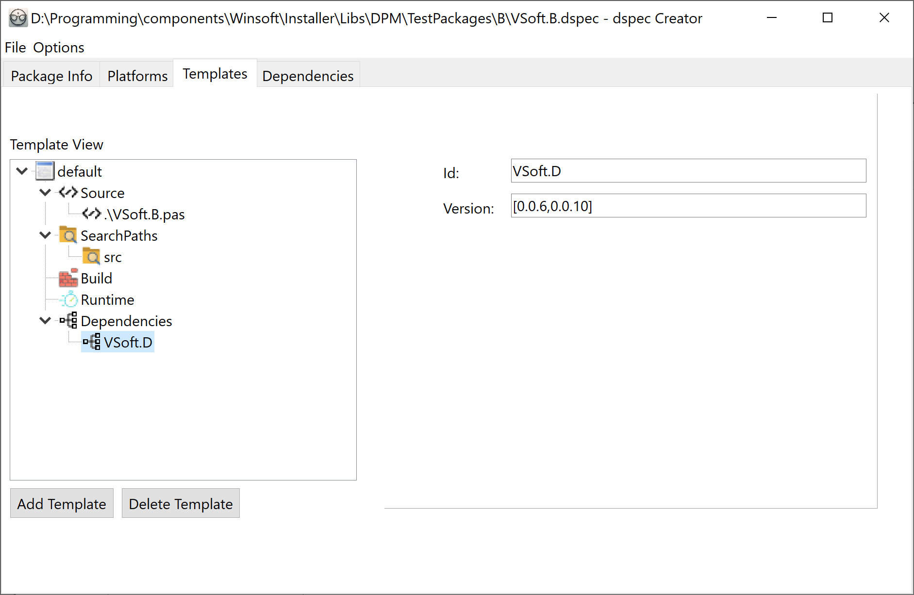

# DelphiPackageManagerDSpecCreator

DSpecCreator is a project that can be used to create and edit .dspec files that are used to create packages that can be used with Delphi Package Manager
https://github.com/DelphiPackageManager/DPM

## Project Status
Project is still very much a work in progress.  You should be able to create a usable .dspec file though.  The below screenshots show the main screens of the program

